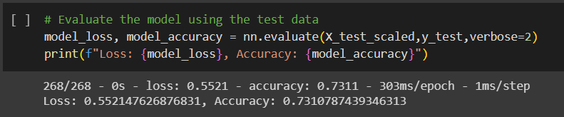

# Deep Learning Challenge: Module 21

## Objective

The goal for the module was to create a deep learning neural network that can aid the non profit foundation Alphabet Soup in the selection of funding applicants based on the likelihood that they will have a successful venture.

## Dependencies and Implementation
This is performed in Python using Google colab notebooks, Pandas and Tensorflow, along with `train_test_split` and `StandardScaler` modules from the sklearn library, as well as the `ModelCheckpoint` module from the keras.callbacks library. The colab notebook will save models generated every 5 epochs to `model_weights` in the `content` folder as it fits the model. 

## Analysis Report

The data used for this analysis is a combination of categorical and numerical features that are as follows:
- `EIN and NAME`: Identification columns
- `APPLICATION_TYPE`: Alphabet Soup application type
- `AFFILIATION`: Affiliated sector of industry
- `CLASSIFICATION`: Government organization classification
- `USE_CASE`: Use case for funding
- `ORGANIZATION`: Organization type
- `STATUS`: Active status
- `INCOME_AMT`: Income classification
- `SPECIAL_CONSIDERATIONS`: Special considerations for application
- `ASK_AMT`: Funding amount requested
- `IS_SUCCESSFUL`: Was the money used effectively

### Data Preprocessing and Cleaning

**What variable(s) are the target(s) for your model?**
- `IS_SUCCESSFUL` is the target for this model, which is a binary classification of 0 for unsuccessful and 1 for successful.

**What variable(s) are the features for your model?**
- `APPLICATION_TYPE`, `APPLICATION_TYPE`, `CLASSIFICATION`, `USE_CASE`, `ORGANIZATION`, `STATUS`, `INCOME_AMT`, `SPECIAL_CONSIDERATIONS`, and `ASK_AMT` were the features of this model.
  - `APPLICATION_TYPE` data was binned and sorted so that all application types in the dataset below 500 were rebranded as "Other". This "Other" label makes up only 276 total entries out of the 30,000+ entries present in the data.
  - `CLASSIFICATION` column was similarly binned and a threshold for classifications below a 1,000 were rebranded as "Other", which resulted in the "Other" label containing 2,261 entries.
  - The categorical data was processed with `pd.get_dummies()` in order to convert them to numerical data for the model.

**What variable(s) should be removed from the input data because they are neither targets nor features?**
- Only the `EIN` and `NAME` columns were dropped as viable features, as they are purely for identification purposes.

### Model Compilation, Training, and Evaluation

**How many neurons, layers, and activation functions did you select for your neural network model, and why?**
- The initial model called for a first and second layer, and a sigmoid output layer.
- The input features had a shape of 43.
- The first layer had 80 neurons, and the second layer had 30, both through relu layers.
- 100 epochs were generated with every 5th model stored

**Were you able to achieve the target model performance?**
- The initial model fell short of the target accuracy with a score of 72.94% and a loss of 56.02%

 

**What steps did you take in your attempts to increase model performance?**
- The first optimization attempt involved lowering the neuron count of both layers by 50% (40 and 15 respectively) to see what effect it had on the loss/accuracy.
  - Results showed marginal improvements to both the loss and accuracy, with 55.21% and 73.10% respectively. However these fall short of the target accuracy of 75%.

 

- The second optimization attempt was an increase in the neuron count by 50% (120 and 45 respectively) to see if it had a greater positive effect than lowering the count.
  - Results showed marginal decreases to both the loss and accuracy, with 55.95% and 72.73% respectively. Still falling short of the target accuracy of 75%, the loss improved marginally compared to the initial model, while the accuracy was slightly worse.

 

- The third optimization attempt kept the same neuron count as in the first optimization attempt since it showed the best performance to date, but added a 3rd hidden layer (with the same neuron count as the 2nd layer, 15).
  - Results showed marginal decreases in performance to both the loss and accuracy when compared to the first optimization attempt, with 55.48% and 72.76% respectively. These results still are shy of the target goal of 75% accuracy and indicate that further attempts would be best served without the additional layer before re-attempting.

 

### Summary/Next Steps

The loss/accuracy analysis from the optimization attempts indicate that further modeling optimization would likely be best served in keeping the neuron count under the initial model attempt (80 and 30 neurons respectively), as the best performing model in the test involved a model with a neuron count less than the number of input features. Since all of the models in this study were unable to reach the target accuracy of 75%, I would not recommend any of them without further optimization.

Additional modeling recommendation to attempt outside of a neural network:
- The combined categorical and numerical dataset, in addition to the binary classification of the target result leads me to believe a Random Forest model would potentially create a working model for this study.
